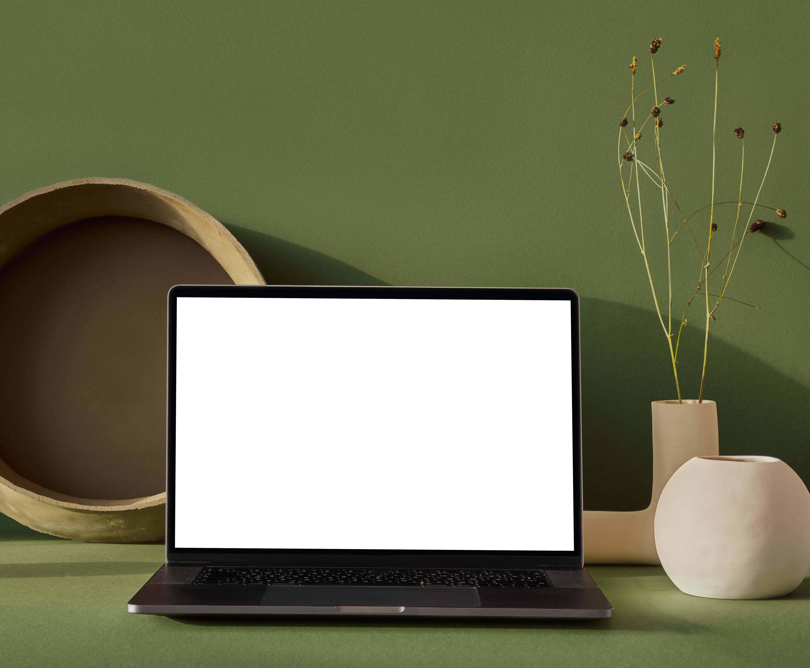

This blog post will talk about keeping things simple. Nothing long, don’t worry. I really don’t write long posts to begin with. Check this out, at work I was tasked with hiding a list of items on page load and not to show any of the list items in the list until the user started to type in the textbox. Then the filtering part of the module would do it’s thing. Doesn’t sound like it’s too hard to do that.  

Google is always your best friend. I start there of course. I find a few things that give me ideas on what to try out. It partially works but, it’s not perfect. Few cups of coffee, Diet Coke, and Mountain Dew, it finally hit me. Keep it simple! Instead of worrying about each list item itself, focus on the elements that can be accessed through JS. That would be the unordered/ordered list element for those of you that are not keeping up . 

Now the issue changes to, how to hide an unordered/ordered list element until the textbox is not blank? Phrasing the question that way is much easier to solve. Here is some example code so that you can see how this was solved. This uses jQuery, I know that there are other options even vanilla JS. I use jQuery because it is easy to use and convenient. aHopefully, it this will help someone else in the future. 


```HTML

<div class="list-item-container" id="example1">
    <fieldset class="seach-form">
        <input type="text" id="example" placeholder="Type text here">
    </fieldset>
    <ul id="list-items">
        <li><span data-filter-hide="true">Example 1</span></li>
        <li><span data-filter-hide="true">Example 2</span></li>
        <li><span data-filter-hide="true">Example 3</span></li>
        <li><span data-filter-hide="true">Example 4</span></li>
        <li><span data-filter-hide="true">Example 5</span></li>
    </ul>
</div>
```

```Javascript
  $('#example1').keyup(function() {
        if($(this).val().length == 0) {
            $('.list-items').hide()
        } else {
            $('.list-items').show()
        }
   }).keyup();

